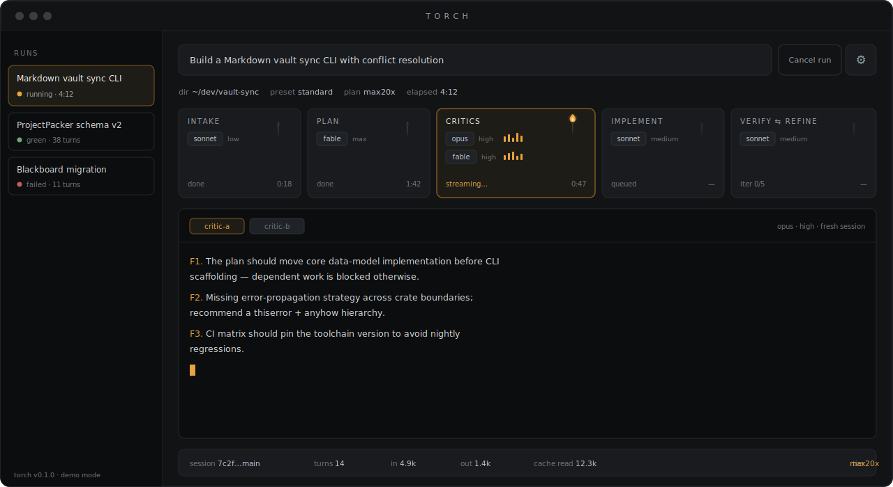
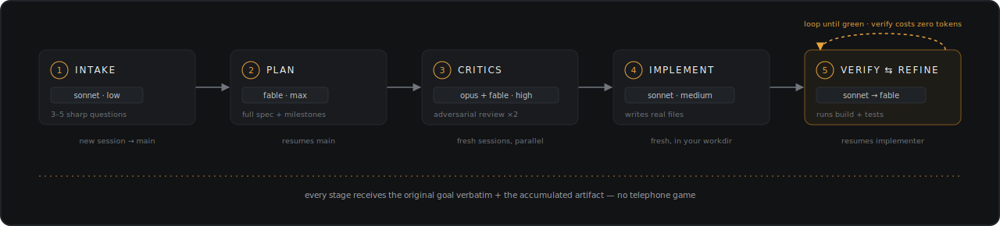
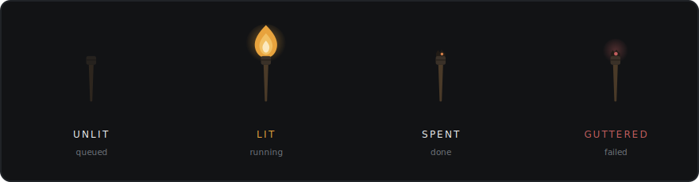
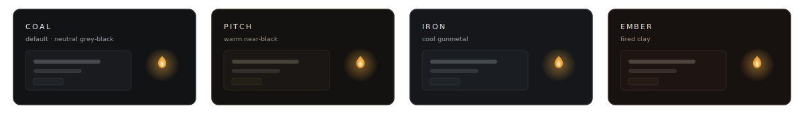

<div align="center">


# Torch

**One torch, carried through five stages.**

A desktop app that turns a single prompt into a verified, multi-stage AI build pipeline —
driven entirely by your existing [Claude Code](https://claude.com/claude-code) subscription.

[](https://github.com/CBaileyDev/Torch/actions/workflows/ci.yml)
[](#-license)
[](https://www.rust-lang.org)
[](https://v2.tauri.app)
[](https://react.dev)
[](https://www.typescriptlang.org)
[](CONTRIBUTING.md)

[Why Torch](#-why-torch) · [The pipeline](#%EF%B8%8F-the-pipeline) · [Status system](#%EF%B8%8F-the-torch-is-the-status-system) · [Getting started](#-getting-started) · [Architecture](#%EF%B8%8F-architecture) · [Contributing](#-contributing)

<br>



*The Control Room — two critics tearing into the plan in parallel while the rest of the pipeline waits its turn.*

</div>

---

## 🔥 Why Torch

Single-session AI coding flattens everything into one context: the same model plans,
critiques its own plan, writes the code, and then *tells you* it works. Torch splits
that into five specialized stages — each a separate headless
[Claude Code](https://claude.com/claude-code) invocation with a model and effort level
matched to that stage's cognitive demands — and never claims success it didn't verify.

| | |
|---|---|
| 🧠 **The right model per stage** | Cheap and fast for intake, maximum-effort frontier for planning, parallel heavyweights for critique. No more paying max-effort rates to write boilerplate. |
| ⚔️ **Adversarial plan review** | Fresh-session critics attack the plan *before a line of code is written* — they share none of the planner's context, so they can't rationalize its mistakes. |
| ✅ **Execution-verified** | The orchestrator itself runs your build and tests (zero tokens) and feeds structured failures back in. If the loop can't go green, Torch says so. |
| 🔑 **No API key, ever** | Drives your locally installed `claude` CLI through your existing subscription login. The usage footer keeps your rate limits visible. |
| 📜 **Artifacts that outlive the app** | Every run writes the brief, plan, critiques, final spec, and per-iteration verify logs as plain files in your working directory. |
| 🖥️ **GUI or headless** | A full Tauri desktop Control Room, or a thin CLI over the same engine for scripts and CI. |

---

## 🛠️ The pipeline

<div align="center">

</div>

| # | Stage | Default model · effort | Session |
|:-:|-------|------------------------|---------|
| 1 | **Intake** — asks you 3–5 sharp clarifying questions, writes the brief and the verify commands | `sonnet` · low | new (becomes the main session) |
| 2 | **Planner** — full spec: stack, modules, contracts, milestones; spawns research subagents when the goal touches fast-moving dependencies | `fable` · max | resumes main |
| 3 | **Critics** — adversarial review in brand-new sessions (`opus` + `fable` in parallel on the 20x tier; single critic otherwise), then a merge pass | `opus`/`fable` · high | fresh ×2, merge resumes main |
| 4 | **Implementer** — writes real files into your working directory; Heavy Mode swaps in `opus` | `sonnet` · medium | fresh, in the workdir |
| 5 | **Verify ⇄ Refine** — the orchestrator runs your build/tests (zero tokens), feeds structured failures back into the implementer's resumed session; the same failure surviving consecutive iterations escalates the refiner to `fable` | `sonnet` → `fable` | resumes implementer |

> **No telephone game.** No stage ever sees only the previous stage's output: every prompt
> carries the original goal verbatim plus the accumulated artifact.

### Presets

| Preset | Shape | Use it when |
|--------|-------|-------------|
| ⭐ **Standard** | The 5-stage loop above | You want the full treatment |
| 📞 **Classic Linear** | The original 6-stage telephone pipeline | You want to A/B it against the loop on the same goal |
| ⚡ **Fast** | Plan → Implement → Verify ⇄ Refine | The goal is small and well-understood |

---

## 🕯️ The torch is the status system

No spinners, no progress bars: each stage card carries a torch.

<div align="center">

</div>

**Guttered** is the only red in the app. The flame palette is identical across all themes —
amber always means *work is happening here*. Everything respects `prefers-reduced-motion`.

### Themes

<div align="center">

</div>

---

## 🚀 Getting started

### Prerequisites

| Requirement | Notes |
|-------------|-------|
| [`claude` CLI](https://claude.com/claude-code) | Installed and logged in — Torch never asks for an API key |
| [Rust](https://rustup.rs) | Stable toolchain |
| [Node.js](https://nodejs.org) | v20+ |

### 🖥️ Desktop app (dev)

```bash
npm install --prefix ui
cargo install tauri-cli --version "^2"
cargo tauri dev          # from crates/torch-app
```

### ⌨️ Headless engine (Fast preset, no GUI)

```bash
cargo build --release -p torch-cli
./target/release/torch --dir /path/to/workdir \
  --verify "cargo test" "Build me a …"
```

### 🎬 Demo mode — zero tokens

Opening the UI in a plain browser runs a scripted fake pipeline, so you can explore
the entire interface without spending a single token:

```bash
npm run dev --prefix ui
```

### 🔑 Bring your own Claude subscription

Torch does not use the Anthropic API. It drives your locally installed `claude` CLI,
which authenticates through your existing Claude subscription login. All stages share
your subscription rate limits — the usage footer keeps that visible at all times.

---

## 📦 What a run leaves behind

Each run writes everything to plain files in your working directory, so the output
survives independent of the app:

```
your-workdir/
└── torch/run-<timestamp>/
    ├── artifact.md      # brief, plan, critiques, final spec
    └── …                # per-iteration verify logs
```

Run history lives in SQLite.

---

## 🏗️ Architecture

```
crates/torch-core   engine: claude process supervision, stream-json parsing,
                    session threading, orchestrator (presets, intake Q&A,
                    parallel critics, checkpoints), deterministic verifier
crates/torch-app    Tauri 2 shell: commands, event bridge, SQLite
crates/torch-cli    thin headless front-end over the engine
ui/                 React + TypeScript Control Room (hand-rolled CSS on a
                    design-token layer; Coal / Pitch / Iron / Ember themes)
```

The engine is UI-agnostic and fully tested against stub `claude` binaries replaying
real CLI output:

```bash
cargo test --workspace   # no login, no network needed
```

See [docs/ipc-contract.md](docs/ipc-contract.md) for the engine ↔ UI event contract.

---

## 🤝 Contributing

Contributions are welcome! Please read [CONTRIBUTING.md](CONTRIBUTING.md) to get started.

- 🐛 [Report a bug](https://github.com/CBaileyDev/Torch/issues/new)
- 💡 [Request a feature](https://github.com/CBaileyDev/Torch/issues/new)
- 🔀 [Open a pull request](https://github.com/CBaileyDev/Torch/pulls)

---

## 📄 License

Dual-licensed under [Apache-2.0](LICENSE-APACHE) or [MIT](LICENSE-MIT), at your option.

<div align="center">
<br>

🔥 *If Torch lit the way for you, consider leaving a* ⭐

</div>
